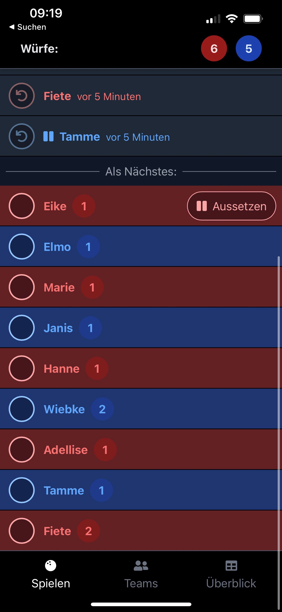
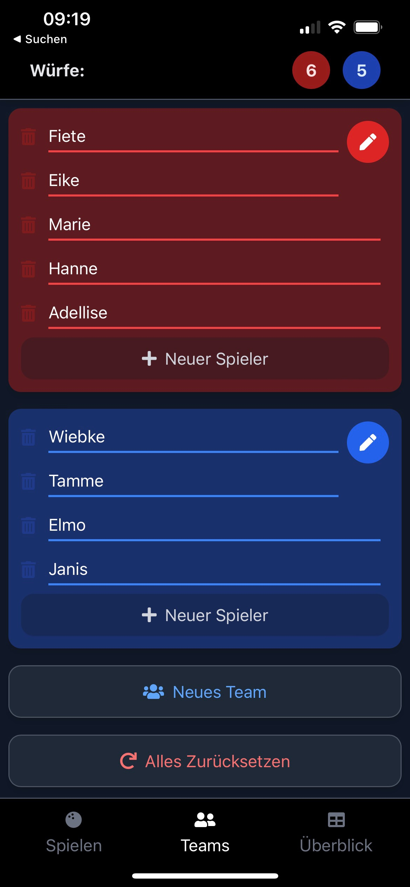
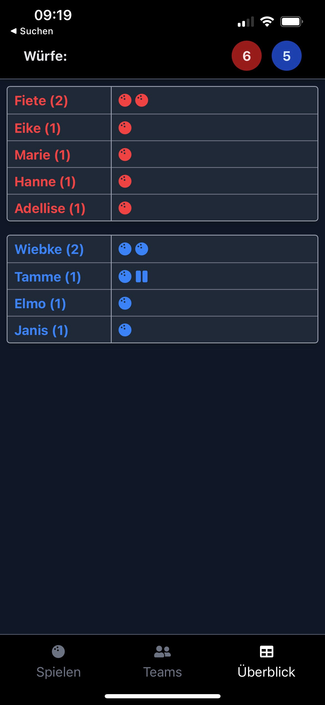

# Boßel

A mobile first PWA to keep track of the [Boßel](https://de.wikipedia.org/wiki/Bo%C3%9Feln) score. 
The app is built using React and Tailwind.

- Offline storage using the browsers localstorage ([Boßel](https://developer.mozilla.org/de/docs/Web/API/Window/localStorage))
- Arbitrary number of teams
- Light and dark mode
- Easy undo and redo

You can run the App directly from GitHub and install it like any PWA.

## [Run the App](https://torbenfricke.github.io/bossel/)

#### [iOS and Android Install Instuctions](https://mobilesyrup.com/2020/05/24/how-install-progressive-web-app-pwa-android-ios-pc-mac/)

  

## More Screenshots 

|  |  | 
|-|-|-